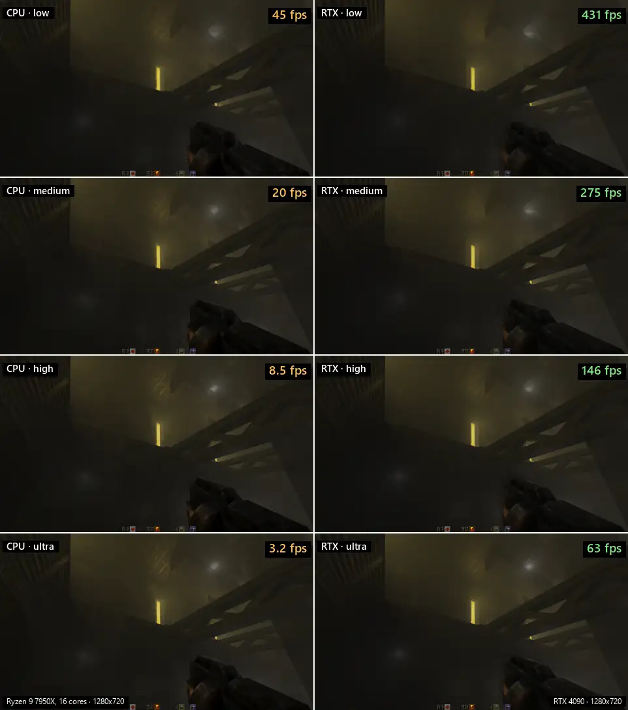
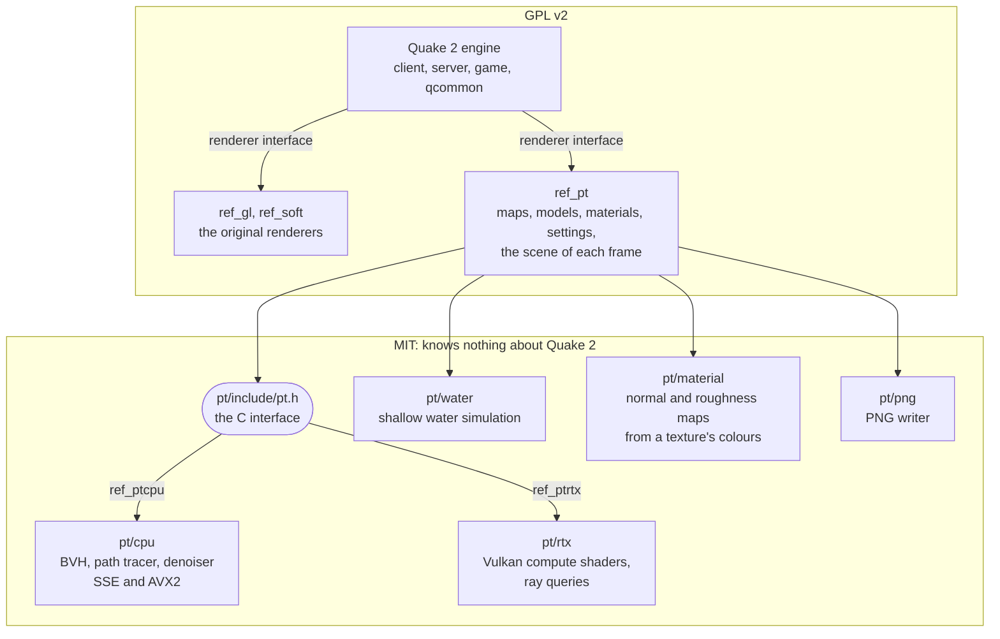
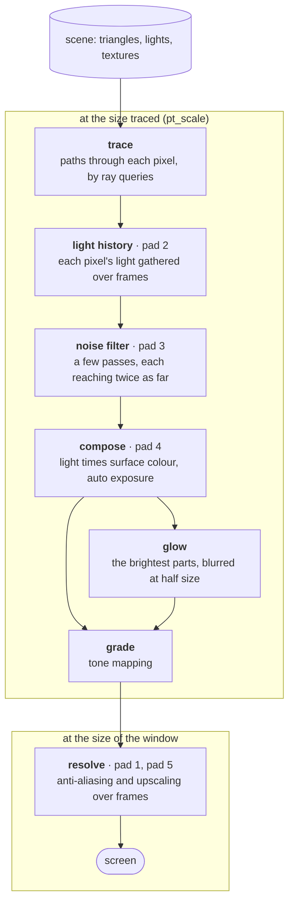

# q2pt

[](https://github.com/jferguson-tech/q2pt/actions/workflows/build.yml)

A path traced renderer for the original Quake 2 source release (3.21), ported
to 64-bit Windows and Linux. The game can be switched while it runs between the original
OpenGL renderer and a path tracer that lights every frame by tracing paths
through the map: no lightmaps and no rasterized geometry. The path tracer
runs on the CPU, or on the GPU with an Nvidia RTX card. The path tracing core is
a separate, engine-independent library under the MIT license.


*Rendered offline from a recorded demo, with fog and motion blur, at 30 frames
a second.*

## Features

**Path tracer** (on the CPU: `ref_ptcpu.dll`)

* Every light in the map lights the scene directly: surface lights, point
  lights and spotlights from the map's entities, the sky, and dynamic lights.
  Lights are importance sampled; indirect light comes from further bounces.
* Physically based materials: GGX specular with roughness and metallic, normal
  maps and smooth shading on models. What kind of thing a surface is is guessed
  from its texture's name, which says that it is metal, that it is not, or
  nothing; it can be set per texture in `pt_materials.txt`.
* Normal, roughness and metal maps made from the game's own textures, on your
  machine, the first time a level shows them. The artists painted a highlight
  on the edges that face the top left of a texture and a shadow on the others;
  that painted light is read back as shape, so panels, seams, rivets and vents
  catch real light the way they were drawn to. Where nothing was painted, dark
  is taken to be deep, and rust and grooves are made rougher than bare metal.
  A surface is metal or it is not, texel by texel, on walls and on the skins
  of models alike: bare steel was painted grey, and rust, paint, wood, cloth
  and skin vivid, so a rusted plate shines only where its steel shows through
  and a soldier's armour where his arms do not. Dull metal is rough metal,
  never half metal, and where metal meets what covers it the edge is
  dithered: the patch thins out into flecks, each of them still metal or
  not. The art shows steel as dark as it looks in a dim room, a
  small part of what steel reflects, so metal reflects more than it was
  painted, in its own hue; `pt_metal_colour` says how much. The painted
  light, once read, is taken out of the texture's colours, where it would
  otherwise light each raised edge a second time. The maps are twice as fine
  as the textures. They are
  kept in `baseq2\pt_cache`, about 110 KB a texture, which can be deleted at
  any time; nothing made from the game's art is part of this repository.
  **F11** switches between these maps and the plain ones made before them.
  Hand-made maps beside a texture are used instead where there are any:
  `<name>_n.tga` (normals), `<name>_r.tga` (roughness) and `<name>_e.tga`
  (emission).
* Glass and liquids reflect and refract with a Fresnel term.
* Three ways to draw water: classic (the original swimming texture), realistic
  (rippled, reflecting and refracting) and simulated (a shallow water
  simulation per pool: waves run as fast as the depth under them allows, so
  they slow and bunch up over a shallow bed, pass round what stands in the
  water and slosh between its banks; the player and whatever moves at the
  surface push a wave ahead of them and leave a wake, and water the map
  calls flowing carries its waves downstream). A simulated surface is drawn
  where its waves stand, not as a level sheet with a pattern of tilts on
  it: crests show in outline and hide what is behind them, and the water
  rises and falls against walls and whatever stands in it. Where it is
  beaten it froths: foam lies in the wake of whatever moves through it
  fast, where something falls in, where waves stand steep or break and
  where a stream runs up against a bank. It is a pale layer of bubbles
  that the water shows through and still shines through a little, closed
  where it is thick and fresh and opening into rings and strings as it
  thins and ages; it rides along on the water and is gone in a few seconds.
  A faint line of it comes and goes along the banks. A hard splash throws
  up spray that falls back and leaves rings (`pt_water_foam`,
  `pt_water_shore`).
* Fog and light shafts from single scattering along the view ray.
* A ball of light to throw (**F**): a lamp behind six round steel plates. It
  bounces, rolls down slopes, knocks into the others and comes to rest, and
  lights wherever it is. The lamp itself is the light, as large and as bright
  as it looks, so the shadows it casts are soft. Walk into one to kick it
  along.
* A denoiser (reprojected history and an edge-stopping spatial filter),
  temporal anti-aliasing that also upscales from a lower internal resolution,
  auto exposure, bloom and a choice of tone mapping.
* The picture as the paths alone make it, noise and all, at a key press
  (**F7**): every frame on its own, or frames added up while the view is at
  rest. Each thing in the filtered picture that depends on earlier frames can
  be switched off by itself from the number pad, with a panel that lists
  what is on, to find which of them a fault comes from.
* Quality presets and a menu page for the main settings, the number of paths
  per pixel among them; everything else is a console variable (`pt_*`).
* On-screen performance info: frame rate, frame times and where the time
  goes, on either path tracer.
* The 64-bit renderer holds two builds of the tracer and picks one when it
  starts: one for processors with AVX2 and FMA, which puts rays to a tree
  with eight children to a node and filters eight pixels at a time, and one
  for any processor. `pt_bench` says which one ran.

**Offline demo rendering**

Play and record a demo with any renderer, then render it frame by frame at
settings far too slow to play with: `pt_render <demo> [fps] [paths per pixel]`.
Each frame is built from nothing at full resolution and saved as a PNG, with
motion blur from the eye's movement (`pt_render_blur`, half the frame's time
unless set otherwise). The sound is mixed in step into a WAV, and a script is
written that turns both into a video with ffmpeg.

How long a frame takes: `demo1` at 1920x1080, 64 paths per pixel, 6 bounces,
motion blur at half the frame's time, 150 frames at 30 a second.

```
CPU   ████████████████████████████████████████  11.56 s a frame   32 cores, 64 threads
RTX   █████████                                   2.65 s a frame   4.4x faster
```

| | seconds a frame | one second of film | the 150 frames |
| --- | --- | --- | --- |
| CPU path tracer: Threadripper PRO 5975WX, **32 cores, 64 threads** | 11.56 | 5 min 47 s | 29 min |
| RTX path tracer: RTX 4090 | 2.65 | 1 min 20 s | 6 min 45 s |

Measured on Linux (Ubuntu 24.04), two runs each, which agreed to within 1
percent. The CPU here is a workstation one: on a processor with fewer cores
the CPU path tracer falls further behind. The time for the 150 frames
includes starting the game and loading the map. The quality presets make no
difference here: offline rendering sets its own bounces and light samples
(`pt_render_bounces`, `pt_render_light_samples`).

**Benchmark**

`pt_bench [demo] [seconds]` plays a demo as fast as the renderer goes and
says how fast that was: frames a second, how the frame times are spread
(average, median, the slowest one in a hundred, the worst) and the average
and worst time of each part of the work, for either path tracer. The demo is
stepped a sixtieth of a second per frame however long a frame takes, so every
machine and both renderers draw the same frames. The report names the
processor or the card and the settings that matter, and is added to
`baseq2\pt_bench.txt`. To compare two machines, give both the same video mode
and `pt_quality`.

**RTX renderer** (`ref_ptrtx.dll`)

The same path tracer on the GPU, for Nvidia RTX cards, written as Vulkan
compute shaders that trace with ray queries. The map and everything that moves
are held in acceleration structures, the moving part rebuilt every frame. The
shaders follow the CPU tracer function for function, and the lights and the
tables for finding them are built by the CPU tracer's own code, so the two
light a map the same way. It has the lighting, materials, glass and liquids,
fog, the three water modes, the denoiser, anti-aliasing, auto exposure, bloom,
tone mapping, screenshots and offline rendering.

Measured with `pt_bench demo1` on an RTX 4090 beside a 16 core Ryzen 7950X,
at 800x600 with one path per pixel, three bounces and the filter on: 176
frames a second, where the CPU renderer manages 10. Offline rendering is
about four times faster than on a 32 core, 64 thread CPU; the figures are
under *Offline demo rendering*.

Its denoiser works as the CPU renderer's does: how far a pixel is smoothed
follows from the noise measured in it, gathered over frames beside the light,
not from how long it has been in view, and a pixel whose noise has settled is
left as it is. Light that comes and goes, a muzzle flash, an explosion, a
bolt flying past, does not trail: what the frame's lights put on a pixel is
known exactly, and where that changes from one frame to the next the
gathered light starts afresh to the same degree, in both renderers.

Like the CPU renderer it can trace a smaller picture than the window and
build the full size one from it over a few frames (`pt_scale`). The same
measurement on the RTX 4090 at other sizes, in frames a second:

| | traced at full size | half the width and height | a quarter |
| --- | --- | --- | --- |
| 1920x1080 | 58 | 155 | 362 |
| 5120x1440 | 23 | 63 | |

The two renderers side by side at each of the four presets (`pt_quality`),
on the same five seconds of `demo1`: the CPU renderer on the left on a 16 core
Ryzen 9 7950X, the RTX renderer on the right on an RTX 4090, both at 1280x720
with the filter on. Each picture changes as often as that renderer draws a
frame; the figures are `pt_bench` averages over the first 24 seconds of the
demo. The clip plays at 60 frames a second, so nothing in it can look
smoother than that.



## Requirements

Your own copy of Quake 2 for the game data, on either system. None of it is
in this repository.

**Windows**

* Windows 10 or 11
* Visual Studio 2022 with the C++ desktop workload, including its CMake tools
  (they bring CMake and Ninja)
* Optional: the [Vulkan SDK](https://vulkan.lunarg.com/), to build the RTX
  renderer. Without it that renderer is left out and everything else builds.

**Linux** (64-bit, X11)

* CMake, a C and C++ compiler, SDL2, and the X11 and OpenGL headers
* For the RTX renderer: the Vulkan headers and loader, and a GLSL compiler
  (`glslc` or `glslangValidator`). Without them that renderer is left out.
* On Ubuntu: `sudo apt install cmake g++ libsdl2-dev libx11-dev libxext-dev
  libgl-dev libglu1-mesa-dev libvulkan-dev glslang-tools`

The game, the original OpenGL renderer and both path traced renderers are
built on Linux. The software renderer is not. The OpenGL renderer there uses
no extensions, so it draws walls and their lighting in two passes.

## Build

**Windows**

```
build.bat                 64-bit, with debug information
build.bat x64 Release
build.bat x86 Release     32-bit
```

The 64-bit programs go to `run\`, the 32-bit ones to `run\x86\`, and the game
library to `run\baseq2\`.

**Linux**

```
cmake -S . -B build/linux
cmake --build build/linux -j
```

`quake2`, `ref_ptcpu.so` and `ref_ptrtx.so` go to `run/`, and `gamex64.so` to
`run/baseq2/`.

The Linux build is compiled with `-Wall -Wextra` and every warning is an
error. Should a newer compiler find something new to say, `-DQ2_WERROR=OFF`
on the first `cmake` line lets it build while that is dealt with.

## Game data

Copy the contents of the `baseq2` folder of your Quake 2 installation
(`pak0.pak` and the rest) into `run\baseq2\`. The folder `run\` is ignored by
git.

## Run

```
cd run
quake2.exe          Windows
./quake2            Linux
```

The 32-bit build is started from `run\x86` with `quake2.exe +set basedir ..`.

W and S walk forward and back and A and D turn left and right, as the arrow
keys do; the mouse looks around. The keys are put on once, where nothing of
the player's own is on them, and can be changed in the options menu like any
other. The game's own setup had looking up on A and the silencer on S.

The video menu lists the original 4:3 modes and wide ones from 1280x720 up
to 3840x2160, with 21:9 and 32:9 modes up to 5120x1440. On a wide picture the
view keeps its height and shows more to the sides.

The last mode, *desktop*, is the size of the desktop, whatever that is: full
screen it fills the display exactly, a laptop's 16:10 one included, without
changing the display mode. Sizes are in real pixels: where Windows is set to
scale the display, as on most laptops, the game is not stretched by it.

**F8** steps through the renderers: OpenGL, CPU path tracer, RTX. They are
also in the video menu, which has a *path tracing options* page. Without an
Nvidia RTX card the RTX renderer is skipped. Setting `PT_VK_VALIDATE` in the
environment turns on the Vulkan validation layer for it.

Some console commands and variables:

| | |
| --- | --- |
| `pt_quality 0`-`3` | preset: low, medium, high, ultra |
| `pt_scale` | internal resolution as a fraction of the window |
| `pt_bounces`, `pt_samples`, `pt_light_samples` | path length, paths per pixel per frame (also a slider in the menu, 1 to 16), lights weighed per point |
| `pt_reflections 0`-`2` | none, glass and water, every shiny surface |
| `pt_water 0`-`2` | classic, realistic, simulated |
| `pt_water_foam` | simulated water: how readily it froths and throws up spray, `1` = as made, `0` = never. Lava never does |
| `pt_water_shore` | how much foam lies along the banks of simulated water, coming and going with the waves: `0.75` as made, `0` = none, `1` = a good deal. Needs `pt_water_foam` above 0 |
| `pt_fog`, `pt_bloom`, `pt_tonemap`, `pt_exposure` | the look of the picture |
| `pt_react` | RTX: how readily light gathered over frames is let go where the lighting is found to have changed, so that it does not trail behind a light that moves, flashes or goes out: `0` = never (the default), `1` = at once. Such places are noisier for a few frames; `pt_debug 13` shows where it acts |
| `pt_fog_history`, `pt_fog_samples` | the light in the air: how many frames of it are kept while things change (6; the rest of the lighting keeps `pt_history`, 8), and at how many points along each view ray it is looked for every frame (2). The air has no surface to be followed by, so its light trails what moves: fewer frames trail less and are noisier, more points are less noisy and cost a shadow ray each |
| `pt_bloom_max` | the most that anything adds to the glow, in times white over white (4): up to half of it a bright thing adds all it has, then less and less, so that a lamp hundreds of times white glows like a strong lamp and does not drown the picture. `0` = no limit |
| `pt_denoise`, `pt_taa`, `pt_history` | filtering over space and time. `pt_history` is how many frames of lighting are blended while things change (8): more is smoother, and leaves light behind what moves for longer. A flash or an explosion is not held back by it: where the light the frame's lights put on a pixel changes by a quarter of its whole light or more, its history starts afresh, and by less, it is cut back in proportion |
| `pt_reflection_history 0`-`1` | what mirrors and glass show is followed from frame to frame where it appears to be, behind the surface, rather than where the surface is; on unless set, for comparison |
| `pt_filter 0`-`2`, `pt_filter_cycle` (**F7**) | the picture as the paths alone make it, noise and all: `0` every frame on its own, `1` the same but frames add up while you stand still, `2` (the default) blended over time and filtered |
| `pt_view 0`-`13`, `pt_view_cycle` (number pad **+**, and **-** to step back) | the scene drawn some other way than as it is, for checking the renderer and for pictures; each means the same in both path tracers. The keys and the menu's row step through all of them but `3`, which is typed in the console. Not kept in the config; offline rendering and screenshots honour it, and changing it starts the picture afresh |
| `pt_view 1`, `2` | materials overridden: `1` clay, every surface matte mid grey whatever its textures say, `2` mirror, every surface as smooth as can be, keeping its colour and whether it is metal. Lights are unchanged and what glows keeps its glow; the sky, glass, and sparks and beams are left alone. In clay, liquids are solid to the eye. Mirror turns reflections on, and is best judged in the raw picture (**F7**): filtered, reflections smear while the view moves |
| `pt_view 3` | console only. The white furnace, a test of whether paths keep the light they carry: every surface, glass and liquids too, is matte and reflects everything, no light or glow is lit, sparks and beams are not there, and a path that reaches the sky or runs out of bounces brings back a half. A tracer that neither makes nor loses light draws every pixel at 186; brighter is light made, darker light lost. Both path tracers read 186 at every `pt_bounces` and `pt_reflections` setting: a surface's shine takes its share of the light first and the matte part has what is left, so the two never reflect more than falls on them. A screenshot of few paths from the RTX renderer can read 185 in places, its filter leaning a little dark until more frames are gathered (`pt_screenshot 256` is clear of it) |
| `pt_view 4` | lighting only: what the eye sees is white, of the material it is, lit by the scene as it is |
| `pt_view 5`, `6` | direct only: light that comes straight from a light, the sky or the air's glow, and what glows seen directly. Indirect only: all the rest, which has bounced or been mirrored on the way. The two add up to the picture, though each is exposed for itself unless `pt_auto_exposure` is `0` |
| `pt_view 7`-`11` | one thing known of the first surface the eye meets, glass included, unlit: `7` base colour, `8` normals (the shading normal in the world, 0.5 + 0.5 n), `9` roughness, `10` metal (white where it is metal, black where it is not), `11` glow (held to 1). The sky is black. But for the base colour a pixel is the number times 255 |
| `pt_view 12` | bounce count: how many times the paths from each pixel bounced after the first surface, on average. The scale is the same on every preset: black none, blue 1, green 2 (cyan between), yellow 3, red 4 or more. A room is mostly blue, and that is the true answer: a path that carries little light is ended at random after its first bounce, and most carry little, so most paths end there whatever `pt_bounces` allows. A blue darker than blue is under 1: a pixel some of whose paths did not bounce at all, which is what reflects nothing (a light, for one) mixed by the filter or the edge smoothing with what does. Lights do not show here; their cost is in `13` |
| `pt_view 13` | cost: every ray traced for the pixel this frame, the eye's, the bounces' and the ones sent towards lights to see whether they are in shadow, all `pt_samples` together. The scale is the same on every preset and each colour is twice the one before: black none, blue 4, green 8 (cyan between, at about 6), yellow 16, red 32 or more. Glass and water are brighter than what is around them, each layer the eye looks through being lit and traced on from. A light fitting is darker: it reflects nothing, so nothing is traced on from it |
| `pt_view 3`, `7`-`13` | shown as traced, to be read off the picture: exposure 1, no auto exposure, no tone curve, no bloom, no fog (but `13` keeps the fog, whose rays are part of the cost) |
| `pt_switch 1`-`6` (number pad **1**-**6**) | switch off, or back on, one of the things in the picture that depend on earlier frames, to find which one a fault comes from: anti-aliasing and the upscaler, light history, the noise filter, auto exposure, upscaling, the history view. A list of them all comes up for a few seconds with what is on and off. Number pad **0** puts them all back; **.** keeps the list up (`pt_show_filter`) |
| `cl_maxfps` | the most frames a second the game runs at: 200 unless set (the game's own setting, which was 90 and in effect 83) |
| `pt_stats 0` | hide the performance info, which is on by default (never shown in offline renders) |
| `pt_simd 0`-`1` | CPU renderer: the build for AVX2 where the processor has it, or the one for any processor, to compare the two |
| `pt_debug 1`-`13` | one part of the picture on its own; `12` is the noise the filter measured in the diffuse light, as it stands after filtering (the standard deviation, times 4) |
| `pt_bump`, `pt_roughness`, `pt_metallic` | scale how deep, how rough and how metallic every surface is taken to be; 1 unless set. Below 1, `pt_metallic` makes what is metal less than metal |
| `pt_material_maps 0`-`1`, `pt_material_toggle` (**F11**) | normal, roughness and metal maps read from each texture's painted light and colours (`1`, the default), or the plain ones of before, which take brightness for height and give the whole of a texture one number for metal: half for what its name says is metal, less for what the name says nothing of. The key switches between the two while playing; the level's surfaces are made again, which takes a moment |
| `pt_metal_edge` | how many texels of a texture the edge between its metal and the rest is dithered over: `3` unless set, `0` for a hard edge. Every texel is metal or not whatever this is; a wider edge only scatters them further. The maps are made again when it changes |
| `pt_metal_colour` | how much of the light metal reflects where it was read from a picture: what a metal painted as dark as the game's steel reflects, `0.05` unless set. Brighter painted metal reflects more, none less than it was painted, and the hue is kept. Steel reflects ten times that, but the game's art is that much darker than the things it shows all over, and at `0.5` metal is white beside everything else. `0` leaves metal the colour it was painted, which is next to black. Takes effect at once |
| `pt_material_delight 0`-`1` | how much of the light painted into a wall texture is taken out of its colours once it has been read as shape: `1` (the default) is all that was read, `0` leaves the colours as they are. Screens and lamps keep theirs |
| `pt_material_cache 0`-`1` | keep the maps that were made in `baseq2\pt_cache`, so that a texture is read once only; on by default |
| `pt_material_show <image>` | write a texture beside what was read from it, as a PNG in `baseq2\scrnshot`: its colours without the painted light, its height, normals, roughness, metal, and what it reflects head on. For example `pt_material_show textures/e1u1/metal1_1` or `pt_material_show models/monsters/soldier/skin` |
| `throwlight [colour]` (**F**), `throwlight clear` | throw a ball of light: `warm`, `white`, `red`, `orange`, `yellow`, `green`, `cyan`, `blue` or `purple`, or the next of them in turn if none is named; `clear` takes back the ones you threw |
| `lightball_max`, `lightball_brightness` | how many balls there may be at once before the oldest goes (6 unless set, at most 24), and how bright the next one thrown is (300; a rocket's light is 200) |
| `screenshot`, `pt_screenshot [paths]` | the frame as shown, or rendered again at high quality |
| `record <name>`, `stop` | record a demo (the game's own commands) |
| `pt_render <demo> [fps] [paths] [start] [length]` | render a demo offline into `baseq2\render\<demo>\`; start and length, in seconds, pick a part of it |
| `pt_render_live 0`-`1` | with `1`, `pt_render` saves the frames the game itself would show, with the settings it is played with, instead of offline ones; the paths argument is not used. Given the frame rate a renderer reaches, that is a film of how it plays; off unless set, and not kept in the config |
| `pt_render_blur 0`-`1` | motion blur for offline rendering: the share of each frame's time the shutter is open; 0.5 unless set, film's 180 degree shutter |
| `pt_bench [demo] [seconds] [quit]` | time a demo: `demo1` and 20 seconds unless given, 0 for all of it; `quit` leaves the game afterwards, for scripts (`quake2 +pt_bench demo1 20 quit`) |

## How it is put together



```
pt/         the path tracing core (MIT): knows nothing about Quake 2
  include/pt.h    the C interface a host program uses
  cpu/            CPU backend: BVH, path tracer, denoiser, output
  rtx/            Vulkan backend: the same tracer as compute shaders
  water/          shallow water simulation
  material/       normal, roughness and metal maps from a texture's colours
  png/            PNG writer
ref_pt/     the renderer DLLs (GPL): turns Quake 2's maps, models and
            per-frame scene into what pt.h asks for
client/, server/, game/, qcommon/, win32/, ref_gl/, ref_soft/
            the original engine, ported to 64 bits
linux/      the Linux build: the program's entry, video, input and sound
            on SDL2 (new), beside id's own Linux sources
```

Both path traced renderers are built from the same `ref_pt` sources and differ
only in the backend they link, so a setting or feature added to the interface
is available to both.

A frame on the RTX renderer, pass by pass. Each box is a compute shader in
`pt/rtx/shaders`; "pad" is the number pad key that switches that step off to
see what it does. With the raw picture (**F7**) the light history and the
noise filter are left out.



## Licensing

* The engine, the game and `ref_pt/` are under the GNU General Public License,
  version 2: see `LICENSE` (the same text as id Software's `gnu.txt`).
* Everything in `pt/` is under the MIT license: see `pt/LICENSE`. It includes
  no Quake 2 code and can be used on its own.
* The programs built from this repository link both and are, as a whole,
  covered by the GPL v2.

## Changes from the original

The starting point is id Software's release of the Quake 2 3.21 source of
December 2001, which is the first commit of this repository. These files of it
were changed in 2026:

| Files | What changed |
| --- | --- |
| `game/g_local.h`, `game/g_main.c`, `game/q_shared.c`, `game/q_shared.h` | 64-bit port: structure offsets, formatted printing into fixed buffers |
| `game/g_items.c` | three variables declared one way in the header and another here, which gcc refuses |
| `qcommon/common.c`, `qcommon/net_chan.c`, `qcommon/qcommon.h` | 64-bit port; leaving the game safely after an error |
| `server/sv_game.c`, `server/sv_send.c`, `server/sv_world.c` | 64-bit port |
| `ref_gl/gl_model.c`, `ref_gl/gl_rmain.c` | 64-bit port: memory for models, the renderer interface |
| `ref_soft/r_alias.c`, `r_edge.c`, `r_main.c`, `r_model.c`, `r_poly.c`, `r_rast.c`, `r_scan.c`, `r_surf.c` | 64-bit port of the software renderer, built without its x86 assembly |
| `win32/cd_win.c`, `conproc.c`, `net_wins.c`, `q_shwin.c`, `rw_imp.c`, `sys_win.c`, `q2.rc` | 64-bit port and building with current Windows headers |
| `win32/vid_dll.c`, `win32/vid_menu.c` | loading the path traced renderers, switching between them, more video modes, closing the window |
| `client/cl_scrn.c` | 64-bit port |
| `client/console.c` | the console on a picture more than 2048 pixels wide |
| `client/cl_main.c`, `client/client.h`, `client/keys.c`, `client/keys.h`, `client/vid.h` | mouse look by default; W, A, S and D do what the arrow keys do; hooks for offline demo rendering; `cl_maxfps` is 200 unless set, and is kept in the config |
| `client/menu.c` | menu pages for the path tracing options and for rendering a demo; "reset defaults" keeps the WASD keys; the commands behind **F7**, **F11** and the number pad |
| `game/g_cmds.c`, `g_local.h`, `g_phys.c`, `q_shared.h`; `client/cl_ents.c`, `client.h`, `menu.c` | the ball of light: the `throwlight` command and its key, a way of moving for what bounces and then rolls, and the turning and the light of a ball as the client draws it |
| `client/snd_dma.c`, `snd_loc.h`, `snd_mem.c`, `snd_mix.c`, `sound.h` | 64-bit port; mixing the sound to a file in step with offline rendering |
| `game/m_*.c`, `game/g_save.c` | braces round each row of the monster animation tables, the flash offsets and the save tables |
| `game/g_ai.c`, `g_chase.c`, `g_combat.c`, `g_monster.c`, `g_spawn.c`, `g_target.c`, `p_hud.c`; `qcommon/cmd.c`, `cmodel.c`, `files.c`; `server/sv_ccmds.c`, `sv_ents.c`, `sv_main.c`, `sv_world.c`; `client/cl_cin.c`, `cl_ents.c`, `cl_fx.c`, `cl_parse.c`, `cl_tent.c`, `qmenu.c`; `ref_gl/gl_image.c`, `gl_light.c`, `gl_local.h`, `gl_mesh.c`, `gl_model.h`, `gl_rsurf.c`; `linux/glob.c`, `net_udp.c`, `q_shlinux.c`, `qgl_linux.c` | what gcc's `-Wall -Wextra` points out, so that the Linux build can treat every warning as an error: casts between signednesses, dead variables, missing returns, defaults and braces, checked reads of save and pak files |

New beside them: `CMakeLists.txt` and `build.bat` (the build), `win32/quake2.manifest`
(what the program tells Windows about itself), `client/cl_render.c`,
`game/g_lightball.c` (the ball of light),
`ref_pt/` and `pt/`, and for Linux `linux/linux.cmake`, `linux/spv_inc.cmake`,
`linux/sys_sdl.c`, `linux/vid_sdl.c`, `linux/snd_sdl.c` and `linux/gl_sdl.c`. The full list is `git diff --name-status` between the first
commit and `main`.

## Credits

Quake 2 was made by id Software, who released its source code under the GPL
in 2001. This is an unofficial project and is not affiliated with or endorsed
by id Software. Quake is a trademark of its owner.
